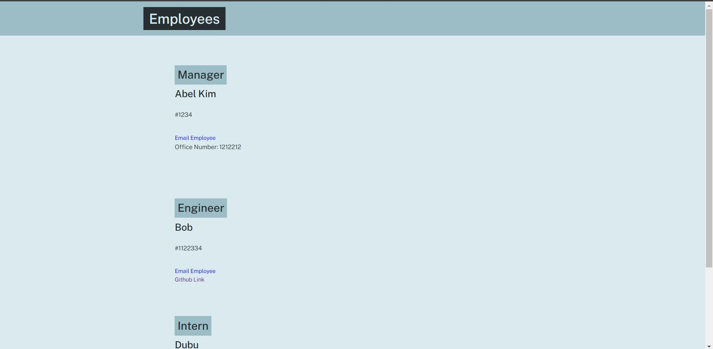

# Employee Team HTML Generator

## Description
Through the use of Jest and Inquirer, I used OOP and TDD to create classes of different types of employees, prompted the user for the employee
data via the console, and created the HTML page from the given data.

## Image Mockup

## Link to Example Video
[Video Link](https://watch.screencastify.com/v/HPBP80D7MdKabpYBuecj)
